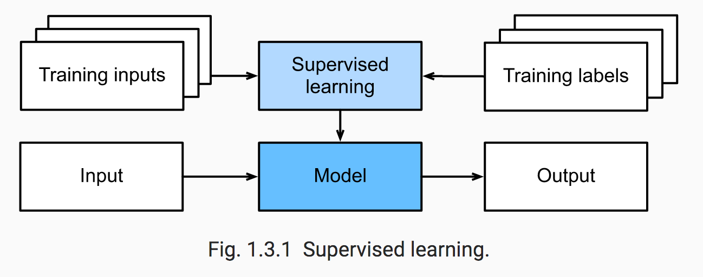
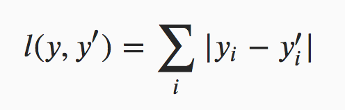
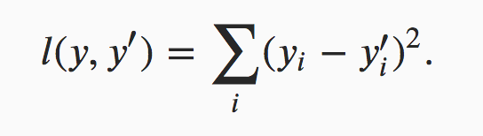

# Dive Into Deep Learning 

The following are my personal notes on the book Dive Into Deep Learning (http://numpy.d2l.ai/).

## Installation

* For more details visit: 
    * http://numpy.d2l.ai/chapter_install/install.html

### Steps

* Install [Miniconda](https://conda.io/en/latest/miniconda.html)
    * ```bash
        # For Mac users (the file name is subject to changes)
        sudo sh Miniconda3-latest-MacOSX-x86_64.sh

        # For Linux users (the file name is subject to changes)
        sudo sh Miniconda3-latest-Linux-x86_64.sh

        # For Mac user
        source ~/.bash_profile

        # For Linux user
        source ~/.bashrc

        # Create an env
        conda create --name d2l
        ```
    
    * You can activate/deactivate an env by doing:
        * `conda activate d2l`
        * `conda deactivate`

    * Download book code:
        * For MacOSX only: `brew install wget`
        * ```bash
            sudo apt-get install unzip
            mkdir d2l-en && cd d2l-en
            wget http://numpy.d2l.ai/d2l-en.zip
            unzip d2l-en.zip && rm d2l-en.zip
            ```

    * Within the “d2l” environment, activate it and install pip. Enter y for the following inquiries.
        * ```bash
            conda activate d2l
            conda install pip
            ```

    * Finally, install “d2l” package within the environment “d2l” that we created.
        * `pip install git+https://github.com/d2l-ai/d2l-en@numpy2`

    * At times, to avoid unnecessary repetition, we encapsulate the frequently-imported and referred-to functions, classes, etc. in this book in the d2l package. For any block block such as a function, a class, or multiple imports to be saved in the package, we will mark it with *# Save to the d2l package*. For example, these are the packages and modules will be used by the d2l package.
        * ```python
            # Save to the d2l package
            from IPython import display
            import collections
            import os
            import sys
            import math
            from matplotlib import pyplot as plt
            from mxnet import np, npx, autograd, gluon, init, context, image
            from mxnet.gluon import nn, rnn
            import random
            import re
            import time
            import tarfile
            import zipfile
            ```
    
* Installing MXNet

    * Before installing mxnet, please first check if you are able to access GPUs. If so, please go to [GPU Support](http://numpy.d2l.ai/chapter_install/install.html#sec-gpu) for instructions to install a GPU-supported mxnet. Otherwise, you can install the CPU version, which is still good enough for the first few chapters.
    
    * ```bash
        # For Linux users
        pip install https://apache-mxnet.s3-accelerate.amazonaws.com/dist/python/numpy/latest/mxnet-1.5.0-py2.py3-none-manylinux1_x86_64.whl

        # For macOS with Python 2.7 users
        pip install https://apache-mxnet.s3-us-west-2.amazonaws.com/dist/python/numpy/latest/mxnet-1.5.0-cp27-cp27m-macosx_10_11_x86_64.whl

        # For macOS with Python 3.6 users
        pip install https://apache-mxnet.s3-us-west-2.amazonaws.com/dist/python/numpy/latest/mxnet-1.5.0-cp36-cp36m-macosx_10_11_x86_64.whl

        # For macOS with Python 3.7 users
        pip install https://apache-mxnet.s3-us-west-2.amazonaws.com/dist/python/numpy/latest/mxnet-1.5.0-cp37-cp37m-macosx_10_11_x86_64.whl
        ```

    * Once both packages are installed, we now open the Jupyter notebook by: `jupyter notebook`

        * At this point open http://localhost:8888 (which usually opens automatically) in the browser, then we can view and run the code in each section of the book.

* Upgrade to a New Version

    * Both this book and MXNet are keeping improving. Please check a new version from time to time.

    1. The URL http://numpy.d2l.ai/d2l-en.zip always points to the latest contents.
    2. Please upgrade “d2l” by pip install git+https://github.com/d2l-ai/d2l-en@numpy2.
    3. For the CPU version, MXNet can be upgraded by `pip uninstall mxnet` then re-running the aforementioned `pip install https...whl` command.

* For GPU support check [this](http://numpy.d2l.ai/chapter_install/install.html) link

## Introduction

* You can think of the parameters as knobs that we can turn, manipulating the behavior of the program. Fixing the parameters, we call the program a model. The set of all distinct programs (input-output mappings) that we can produce just by manipulating the parameters is called a family of models. And the meta-program that uses our dataset to choose the parameters is called a learning algorithm.

* Before we can go ahead and engage the learning algorithm, we have to define the problem precisely, pinning down the exact nature of the inputs and outputs, and choosing an appropriate model family. In this case, our model receives a snippet of audio as input, and it generates a selection among {yes, no} as output—which, if all goes according to plan, will closely approximate whether (or not) the snippet contains the wake word.

* If we choose the right family of models, then there should exist one setting of the knobs such that the model fires yes every time it hears the word ‘Alexa’. Because the exact choice of the wake word is arbitrary, we’ll probably need a model family capable, via another setting of the knobs, of firing yes on the word ‘Apricot’. We expect that the same model should apply to ‘Alexa’ recognition and ‘Apricot’ recognition because these are similar tasks. However, we might need a different family of models entirely if we want to deal with fundamentally different inputs or outputs, say if we wanted to map from images to captions, or from English sentences to Chinese sentences.

* As you might guess, if we just set all of the knobs randomly, it’s not likely that our model will recognize ‘Alexa’, ‘Apricot’, or any other English word. In deep learning, the learning is the process by which we discover the right setting of the knobs coercing the desired behaviour from our model.

* The training process usually looks like this:

    1. Start off with a randomly initialized model that can’t do anything useful.
    2. Grab some of your labeled data (e.g. audio snippets and corresponding {yes,no} labels)
    3. Tweak the knobs so the model sucks less with respect to those examples
    4. Repeat until the model is awesome.
    

* Learning from raw audio signal, directly from the pixels in images, and mapping between sentences of arbitrary lengths and across languages are problems where deep learning excels and traditional ML tools faltered. 
    * Deep models are deep in precisely the sense that they learn many layers of computation.
    * It turns out that these many-layered (or hierarchical) models are capable of addressing low-level perceptual data in a way that previous tools could not. 

* One key advantage of deep learning is that it replaces not only the shallow models at the end of traditional learning pipelines, but also the labor-intensive feature engineering. Secondly, by replacing much of the domain-specific preprocessing, deep learning has eliminated many of the boundaries that previously separated computer vision, speech recognition, natural language processing, medical informatics, and other application areas, offering a unified set of tools for tackling diverse problems.

### The Key Components: Data, Models, and Algorithms

* In our wake-word example, we described a dataset consisting of audio snippets and binary labels gave a hand-wavy sense of how we might train a model to approximate a mapping from snippets to classifications. This sort of problem, where we try to predict a designated unknown label given **known inputs (also called features or covariates)**, and examples of both is called supervised learning, and it’s just one among many kinds of machine learning problems. In the next section, we’ll take a deep dive into the different ML problems. First, we’d like to shed more light on some core components that will follow us around, no matter what kind of ML problem we take on:

    1. **The data** that we can learn from
    2. A **model** of how to transform the data
    3. A **loss function** that quantifies the badness of our model
    4. An **algorithm** to adjust the model’s parameters to minimize the loss

### Data

* It might go without saying that you cannot do data science without data. We could lose hundreds of pages pondering the precise nature of data but for now we’ll err on the practical side and focus on the key properties to be concerned with. Generally we are concerned with a collection of examples (also called data points, samples, or instances). In order to work with data usefully, we typically need to come up with a suitable numerical representation. **Each example typically consists of a collection of numerical attributes called features or covariates.**

* If we were working with image data, each individual photograph might constitute an example, each represented by an ordered list of numerical values corresponding to the brightness of each pixel. A 200×200 color photograph would consist of 200×200×3=120000 numerical values, corresponding to the brightness of the red, green, and blue channels corresponding to each spatial location. In a more traditional task, we might try to predict whether or not a patient will survive, given a standard set of features such as age, vital signs, diagnoses, etc.


* When every example is characterized by the same number of numerical values, we say that **the data consists of fixed-length vectors** and we describe the (constant) length of the vectors as the **dimensionality of the data**.

* However, not all data can easily be represented as fixed length vectors. While we might expect microscrope images to come from standard equipment, we can’t expect images mined from the internet to all show up in the same size. While we might imagine cropping images to a standard size, text data resists fixed-length representations even more stubbornly. Consider the product reviews left on e-commerce sites like Amazon or TripAdvisor. Some are short: “it stinks!”. Others ramble for pages. One major advantage of deep learning over traditional methods is the **comparative grace with which modern models can handle varying-length data.**

* To drive the point home, many of the most exciting models in deep learning either don’t work without large data sets. Some others work in the low-data regime, but no better than traditional approaches.

### Objective functions

* In order to develop a formal mathematical system of learning machines, we need to have formal measures of how good (or bad) our models are. **In machine learning, and optimization more generally, we call these objective functions.**
    * By convention, we usually define objective funcitons so that **lower is better.**
    * This is merely a convention. You can take any function 𝑓 for which higher is better, and turn it into a new function 𝑓′ that is qualitatively identical but for which lower is better by setting 𝑓′=−𝑓. **Because lower is better, these functions are sometimes called loss functions or cost functions.**

* When trying to predict numerical values, the most common **objective function** is **squared error (𝑦−𝑦̂ )2**.
    * For classification, the most common objective is to minimize error rate, i.e., the fraction of instances on which our predictions disagree with the ground truth. 

* Some objectives (like squared error) are easy to optimize. Others (like error rate) are difficult to optimize directly, owing to non-differentiability or other complications. In these cases, it’s common to optimize a surrogate objective.

* The best values of our model’s parameters are learned by minimizing the loss incurred on a training set consisting of some number of examples collected for training. However, doing well on the training data doesn’t guarantee that we will do well on (unseen) test data. So we’ll typically want to split the available data into two partitions: the training data (for fitting model parameters) and the test data (which is held out for evaluation), reporting the following two quantities:

    * **Training Error**: The error on that data on which the model was trained. You could think of this as being like a student’s scores on practice exams used to prepare for some real exam. Even if the results are encouraging, that does not guarantee success on the final exam.

    * **Test Error**: This is the error incurred on an unseen test set. This can deviate significantly from the training error. **When a model fails to generalize to unseen data, we say that it is overfitting.** In real-life terms, this is like flunking the real exam despite doing well on practice exams.

### Optimization algorithms

* Once we’ve got some data source and representation, a model, and a well-defined objective function, **we need an algorithm capable of searching for the best possible parameters for minimizing the loss function**. The most popular optimization algorithms for neural networks follow an approach called **gradient descent**. In short, at each step, they check to see, for each parameter, which way the training set loss would move if you perturbed that parameter just a small amount. They then update the parameter in the direction that reduces the loss.

### Supervised learning

* Supervised learning addresses the task of predicting targets given input data. The **targets, also commonly called labels, are generally denoted y.**

* The **input** data points, also commonly **called examples or instances**, are typically denoted **𝑥**. The goal is to produce a model 𝑓𝜃 that maps an **input 𝑥 to a prediction 𝑓𝜃(𝑥)**

* To ground this description in a concrete example, if we were working in healthcare, then we might want to predict whether or not a patient would have a heart attack. This observation, heart attack or no heart attack, would be our label 𝑦. The input data 𝑥 might be vital signs such as heart rate, diastolic and systolic blood pressure, etc.

* The supervision comes into play because for choosing the **parameters 𝜃**, we (the supervisors) provide the model with a collection of labeled examples (𝑥𝑖,𝑦𝑖), where each example 𝑥𝑖 is matched up against its correct label.
    * In probabilistic terms, we typically are interested in estimating the conditional probability 𝑃(𝑦|𝑥). 

* Put plainly, the learning process looks something like this. Grab a big pile of example inputs, selecting them randomly. Acquire the ground truth labels for each. Together, these inputs and corresponding labels (the desired outputs) comprise the training set. We feed the training dataset into a supervised learning algorithm. So here the supervised learning algorithm is a function that takes as input a dataset, and outputs another function, the learned model. Then, given a learned model, we can take a new previously unseen input, and predict the corresponding label.
    *  

### Regression

* Perhaps the simplest supervised learning task to wrap your head around is Regression. Consider, for example a set of data harvested from a database of home sales. We might construct a table, where each row corresponds to a different house, and each column corresponds to some relevant attribute, such as the square footage of a house, the number of bedrooms, the number of bathrooms, and the number of minutes (walking) to the center of town. **Formally, we call one row in this dataset a feature vector, and the object (e.g. a house) it’s associated with an example.**

* If you live in New York or San Francisco, and you are not the CEO of Amazon, Google, Microsoft, or Facebook, the (sq. footage, no. of bedrooms, no. of bathrooms, walking distance) feature vector for your home might look something like: [100,0,.5,60]. However, if you live in Pittsburgh, it might look more like [3000,4,3,10]. Feature vectors like this are essential for all the classic machine learning problems. **We’ll typically denote the feature vector for any one example 𝐱𝐢 and the set of feature vectors for all our examples 𝑋.**

* What makes a problem a regression is actually the outputs. Say that you’re in the market for a new home, you might want to estimate the fair market value of a house, given some features like these. **The target value, the price of sale, is a real number.** We denote any individual target 𝑦𝑖 (corresponding to example 𝐱𝐢) and the set of all targets 𝐲 (corresponding to all examples X). **When our targets take on arbitrary real values in some range, we call this a regression problem**. The goal of our model is to produce predictions (guesses of the price, in our example) that closely **approximate the actual target values**. We denote these predictions **𝑦̂𝑖** and if the notation seems unfamiliar, then just ignore it for now. We’ll unpack it more thoroughly in the subsequent chapters.

* However, if you can easily pose your problem as ‘Is this a _ ?’, then it’s likely, classification, a different fundamental problem type that we’ll cover next. 
    * Even if you’ve never worked with machine learning before, you’ve probably worked through a regression problem informally. Imagine, for example, that you had your drains repaired and that your contractor spent 𝑥1=3 hours removing gunk from your sewage pipes. Then she sent you a bill of 𝑦1=$350. Now imagine that your friend hired the same contractor for 𝑥2=2 hours and that she received a bill of 𝑦2=$250. If someone then asked you how much to expect on their upcoming gunk-removal invoice you might make some reasonable assumptions, such as more hours worked costs more dollars. You might also assume that there’s some base charge and that the contractor then charges per hour. If these assumptions held true, then given these two data points, you could already identify the contractor’s pricing structure: $100 per hour plus $50 to show up at your house. If you followed that much then you already understand the high-level idea behind linear regression (and you just implicitly designed a linear model with bias).

* In this case, we could produce the parameters that exactly matched the contractor’s prices. **Sometimes that’s not possible, e.g., if some of the variance owes to some factors besides your two features.** In these cases, we’ll try to learn models that minimize the distance between our predictions and the observed values. In most of our chapters, we’ll focus on one of two very common losses, the L1 loss where

    

    and the least mean squares loss, aka L2 loss where
    
    

* As we will see later, the 𝐿2 loss corresponds to the assumption that our data was corrupted by Gaussian noise, whereas the 𝐿1 loss corresponds to an assumption of noise from a Laplace distribution.

### Classification

* While regression models are great for addressing **how many?** questions, lots of problems don’t bend comfortably to this template.

* For example, a bank wants to add check scanning to their mobile app. This would involve the customer snapping a photo of a check with their smartphone’s camera and the machine learning model would need to be able to automatically understand text seen in the image. It would also need to understand hand-written text to be even more robust. This kind of system is referred to as optical character recognition (OCR), and the kind of problem it solves is called a classification. **It’s treated with a distinct set of algorithms than those that are used for regression.**

* In classification, we want to look at a feature vector, like the pixel values in an image, and then predict which category (formally called classes), among some set of options, an example belongs.

* For hand-written digits, we might have 10 classes, corresponding to the digits 0 through 9. The simplest form of classification is when there are only two classes, a problem which we call binary classification. For example, our dataset 𝑋 could consist of images of animals and our labels 𝑌 might be the classes {cat,dog}. **While in regression, we sought a regressor to output a real value 𝑦̂ , in classification, we seek a classifier, whose output 𝑦̂  is the predicted class assignment.**

* For reasons that we’ll get into as the book gets more technical, it’s pretty hard to optimize a model that can only output a hard categorical assignment, e.g. either cat or dog. **It’s a lot easier instead to express the model in the language of probabilities. Given an example 𝑥, the model assigns a probability 𝑦̂𝑘 to each label 𝑘.**. Because these are probabilities, they need to be positive numbers and add up to 1. This means that we only need 𝐾−1 numbers to give the probabilities of 𝐾 categories. If there’s a 0.6 (60%) probability that an unfair coin comes up heads, then there’s a 0.4 (40%) probability that it comes up tails. Returning to our animal classification example, a classifier might see an image and output the probability that the image is a cat Pr(𝑦=cat|𝑥)=0.9. We can interpret this number by saying that the classifier is 90% sure that the image depicts a cat. 

* **The magnitude of the probability for the predicted class is one notion of confidence.**
    * It’s not the only notion of confidence and we’ll discuss different notions of uncertainty in more advanced chapters.

* When we have more than two possible classes, we call the problem **multiclass classification**.
    * For two classes that is a **binary classifier**

* While we attacked regression problems by trying to minimize the L1 or L2 loss functions, the common loss function for classification problems is called **cross-entropy**.

*  **Hierarchies assume that there exist some relationships among the many classes.** So not all errors are equal - we prefer to misclassify to a related class than to a distant class. Usually, this is referred to as hierarchical classification. One early example is due to Linnaeus, who organized the animals in a hierarchy.

* In the case of animal classification, it might not be so bad to mistake a poodle for a schnauzer, but our model would pay a huge penalty if it confused a poodle for a dinosaur. Which hierarchy is relevant might depend on how you plan to use the model. For example, rattle snakes and garter snakes might be close on the phylogenetic tree, but mistaking a rattler for a garter could be deadly.

### Tagging

* 

* As you can see, there’s a cat in the picture, and a rooster, a dog, a donkey and a bird, with some trees in the background. Depending on what we want to do with our model ultimately, treating this as a binary classification problem might not make a lot of sense. Instead, we might want to give the model the option of saying the image depicts a cat and a dog and a donkey and a rooster and a bird.

* The problem of learning to predict classes that are not mutually exclusive is called multi-label classification. 

* Think of the tags people might apply to posts on a tech blog, e.g., ‘machine learning’, ‘technology’, ‘gadgets’, ‘programming languages’, ‘linux’, ‘cloud computing’, ‘AWS’. A typical article might have 5-10 tags applied because these concepts are correlated. Posts about ‘cloud computing’ are likely to mention ‘AWS’ and posts about ‘machine learning’ could also deal with ‘programming languages’.

# Dictonary

* Overfitting: a model fails to generalize to unseen data

* Objective function: Evaluate model quality
    * loss function
    * Closest to 0 is better

* Optimization algorithms: Minimize loss
    * Gradient descent

* Labels: Are generally denoted y

* Input: called examples or instances

* Tagging
    * Auto-tagging problems are typically best described as multi-label classification problems.
    * multi-label classification: The problem of learning to predict classes that are not mutually exclusive. 
        * e.g: a photo with a dog, cat and cow

* Classification: we want to look at a feature vector, like the pixel values in an image, and then predict which category (formally called classes), among some set of options, an example belongs.

    * Confidence: The magnitude of the probability for the predicted class is one notion of confidence.

    * Loss function: cross-entropy

    * Hierarchies: assume that there exist some relationships among the many classes.

* Regression: When our targets take on arbitrary **real values** in some range, we call this a regression problem
    * The goal of our model is to produce predictions (guesses of the price, in our example) that closely approximate the actual target values (y)
    * How many hours will this surgery take? - regression
    * How many dogs are in this photo? - regression.
    * However, if you can easily pose your problem as ‘Is this a _ ?’, then it’s likely, classification, a different fundamental problem type that we’ll cover next. 

    * Loss function: mean squares loss


* Variables
    * x: input
    * y: label